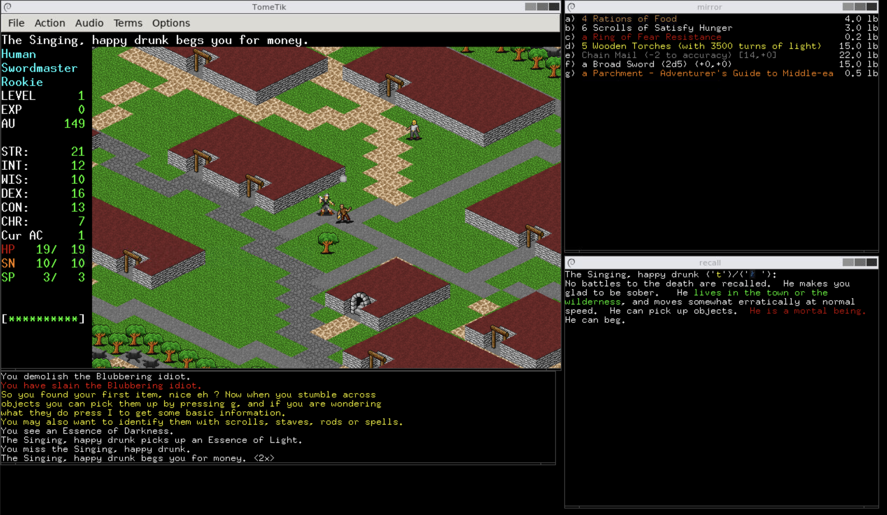
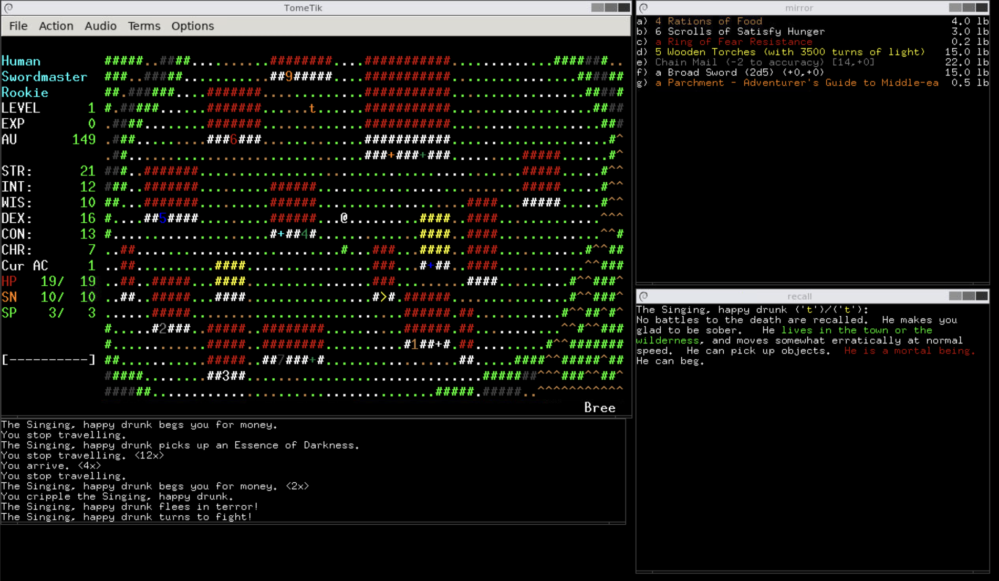

# TomeTik

**TomeTik** is *ToME — Troubles of Middle Earth*, the classic Tolkien-themed
roguelike, played with **graphical tiles** instead of plain text — including an
optional **isometric view**.

Despite the "Tik" in the name, it has nothing to do with Tcl/Tk.

## A fork of the original TomeTik

This is a fork of **TomeTik**, the graphical version of ToME created by
**Pousse Rapière** around 2004 (homepage: `pousse.rapiere.free.fr/tome/`). The
original TomeTik is what made ToME playable with David Gervais's tiles and added
the first isometric mode — all the credit for that work goes to Pousse Rapière.

What this fork does is take **TomeTik 0.3** (originally built on ToME 2.2.2),
bring it to modern systems — it now compiles with current toolchains and runs on
Linux and Windows, with several frontends and a finished isometric renderer — and
**update the game base to ToME 2.3.5**, the last release of the 2.x line.

## How you can play

The graphics are optional — you can pick whatever you like:

- **Isometric** tiles (shown above),
- **2D** top-down tiles, or
- plain **ASCII** text, the original roguelike look.

## Reused from OmnibandTk

OmnibandTk is a separate Tk frontend for playing many different Angband variants.
It isn't related to TomeTik, but it also targets ToME, so we reuse its
**`graf-*.prf` tile-mapping files** (which tell the game what tile to draw for
each monster, object and terrain), along with the David Gervais isometric tileset
they use.

## Frontends

- **GTK2** — native multi-window UI with 32×32 tiles and the isometric mode. The
  main way to play on Linux.
- **GDI (Windows)** — the classic Windows build, producing a standalone
  `tometik.exe` (cross-compiled with mingw-w64).
- **Docker** — scripts to build any of the above and to *play in your browser*
  via a VNC / noVNC container, no local install needed.

## Some of what's been added in this fork

- A finished, portable **isometric renderer** (the original was a stub).
- **Click-to-move** with A\* pathfinding and an **autoexplore** option.
- **Context action on click** (e.g. click a monster to attack it).
- **Health bars** over the player and visible monsters.
- **Sound and music** through SDL2_mixer.
- Arrow keys for movement, wide ("big") tiles on by default, and a modern build.

## Credits

- **Pousse Rapière** — the original TomeTik.
- **David Gervais** — the tiles (32×32 and isometric).
- **Eric "DarkGod" Stevens** and the ToME team — ToME itself, on the Angband /
  PernAngband lineage.

See `credits.txt` for the full history.
